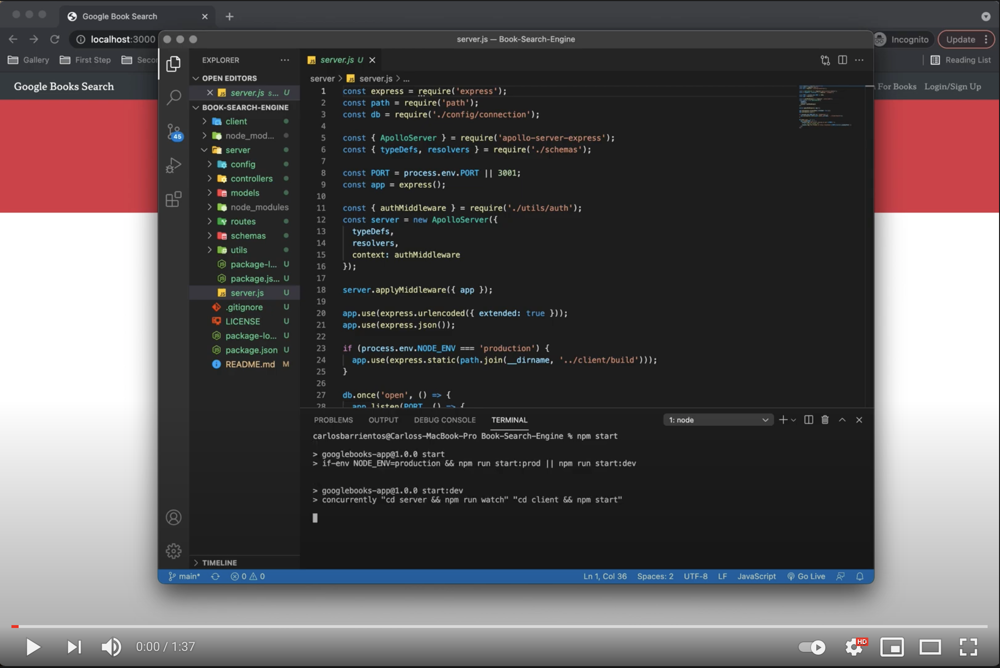

# Book-Search-Engine
Find and retrieve information on some of your favorite books using the Google Books API Search Application! Created with a focus on using the MERN stack.

[Link to GitHub Repository](https://github.com/WitnessMyHands/Book-Search-Engine)

[Link to Heroku Deployed Application](https://wmh-book-search-engine.herokuapp.com/)

## Table Of Contents
- [Description](#Description)
- [Installation](#Installation)
- [Gallery](#Gallery)
- [Questions](#Questions)

## Description
This fully function application allows users to search for books using the Google Books API. The application was built using MongoDB for databasing, Express/Node.js for server-side and API & ReactJS for front end deployment. Styled using Bootstrap.

## Installation
- Clone the Repository using Terminal: `git clone git@github.com:WitnessMyHands/Book-Search-Engine.git`
- Change directory, "cd" into the Local Folder
- Install Dependencies with: `npm install`
- To run the Application you will need to run: `npm start`
- When complete, the web application should open in a new window. If browser window does not open, navigate to - https://localhost:3000 

## Gallery

## License

## Questions
*Please contact WitnessMyHands via GitHub with any questions or concerns.*

- https://github.com/WitnessMyHands
